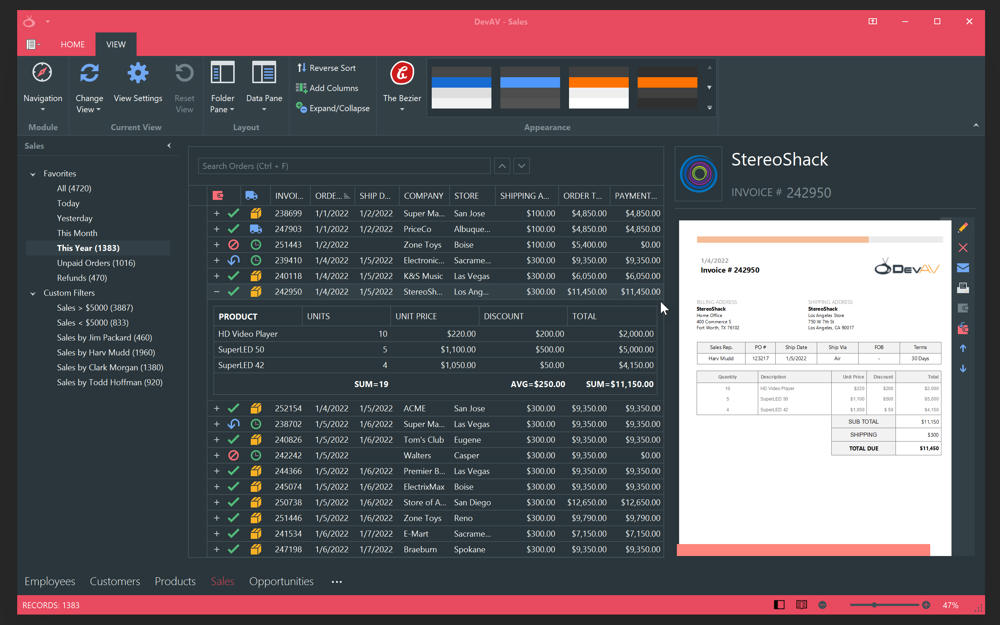

The product design is undoubtedly one of the aspects that affect consumer decisions. A well-thought and informative application design that positively impacts a user experience and allows users to perform their tasks in an intuitive, straightforward manner is a trait that is almost equally important to other product values. 

In this video, we'll have a look at how to design UIs that are not held back by the limited capabilities of WinForms controls, and allow you to maximize the full potential of modern design and usability trends.

If you look for "modern UI winforms" videos here on YouTube, you'll find multiple tutorials that essentially boil down to emulating a material design in WinForms apps. Flat design elements, often without shadows and borders delimiting neighboring controls, monochrome backgrounds with bright accent colors. If this pretty much sums up your requests regarding an appealing design, you can instantly have it without investing a single minute in playing around with application appearance settings. A huge variety of DevExpress WinForms skins and support for latest surface effects from Microsoft (such as Acrylic or Mica) ensure that your apps can always boast a pixel-perfect modern look.

However, some UI techniques simply cannot be replicated. If you search for design ideas on Figma or Pinterest, you'll stumble on web or mobile app layouts that showcase elements you cannot emulate in WinForms due to the simple lack of the appropriate tooling. Unlike in WPF where you can apply templates and completely alter the look of a control, WinForms controls are much more rigid. Some controls can have "Style" or "View" property, but apart from that, your only way to modify the control's layout so that it matches your business needs is to create a descendant and/or modify the skin in the DevExpress Skin Editor.

The HTML & CSS Templates available in DevExpress controls allow you to eliminate this platform's weakness and harness the flexibility of web design techniques. In this video, I'll demonstrate how to build a sample application with a completely custom parent form and content controls that utilize web-inspired templates.